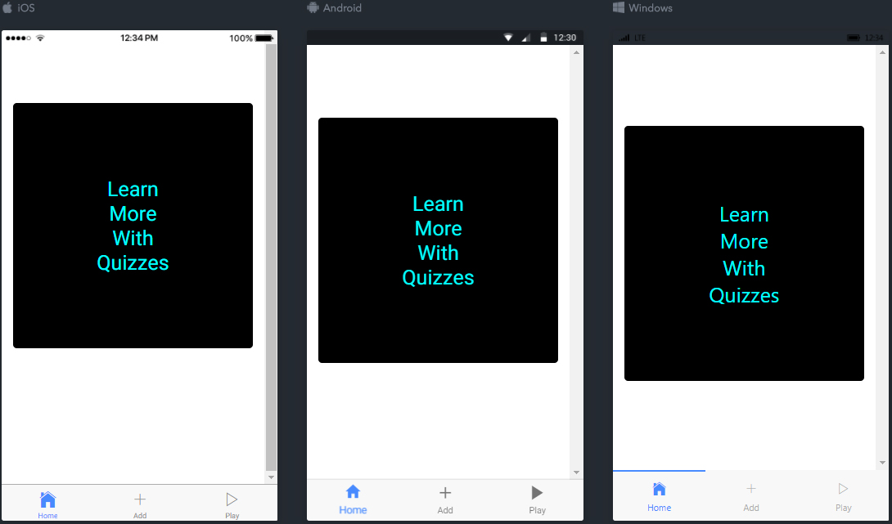
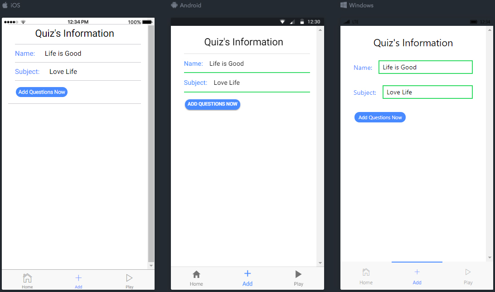
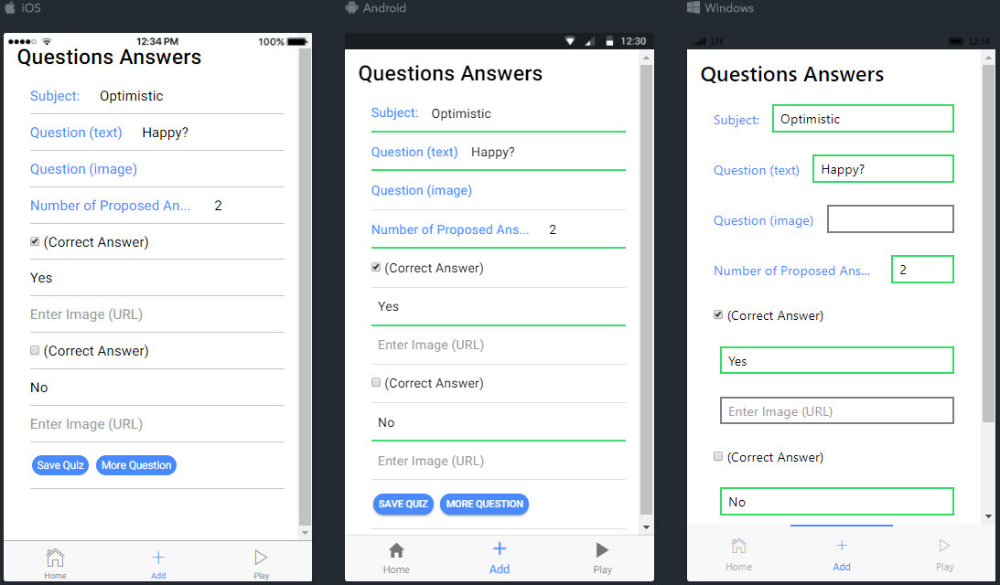
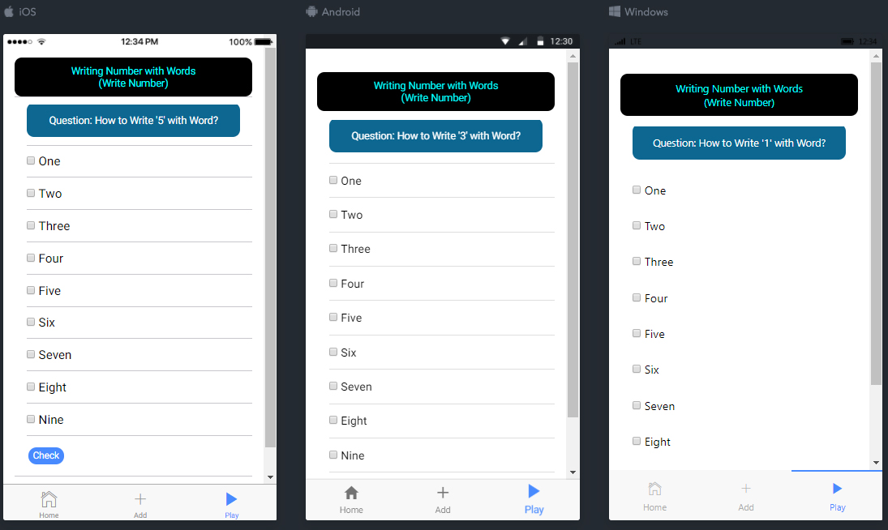
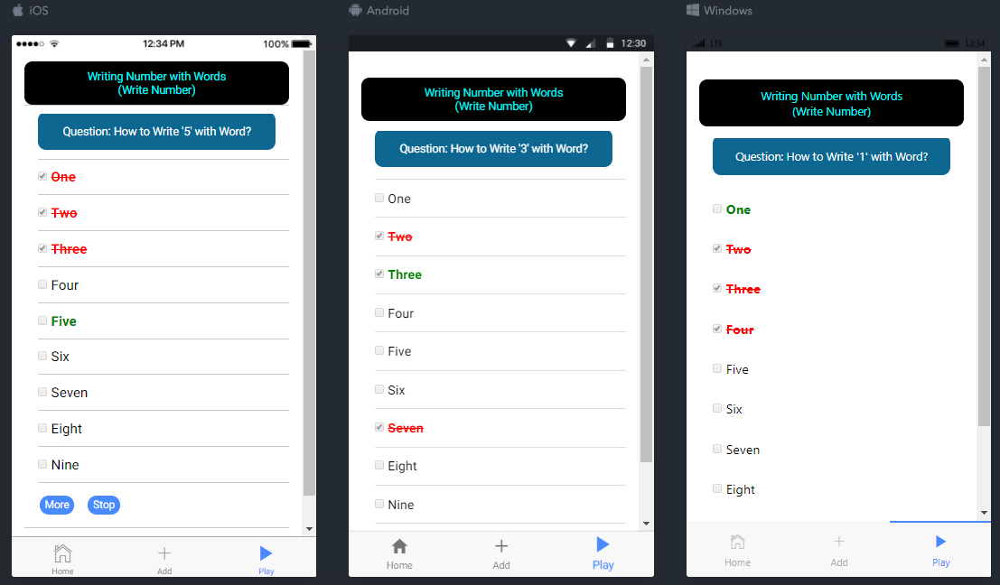

# Quiz Application for Mobile (using Ionic 2)

## Aim
Learn how to build **Mobile App** (**Android**, **iOS**) with **3-tier Architecture**. Each platform  (**Android**, **iOS**) could have specifics options (sensors, for example). 

## Technologies
**MongoDB** (**mLab** for "online" version or another choice: **firebase**), **Angular 2**. We have:

- [ ] [**Quiz with MongoDB**](https://github.com/DinhLeGaulois/quiz_clientServer_MongoDB): **CSS**, **jQuery**, **Express/NodeJS**, **MongoDB**
- [ ] [**Quiz with PHP**](https://github.com/DinhLeGaulois/quiz_PHP): **CSS**, **jQuery**, **BootStrap**, **PHP**, **MongoDB**
- [ ] [**Quiz with M.E.R.N. Stack**](https://github.com/DinhLeGaulois/quiz_clientServer_MongoDB_React): **CSS**, **jQuery**, **Express/NodeJS**, **MongoDB**, **React**
- [ ] [**Quiz with M.E.A.N. Stack**](https://github.com/DinhLeGaulois/quiz_clientServer_MongoDB_Angular): **CSS**, **jQuery**, **Express/NodeJS**, **MongoDB**, **Angular** (version 2)
- [x] [**Quiz with Mobile App**](https://github.com/DinhLeGaulois/quiz_MobileApp): **Ionic 2**, **Angular** (version 2)

## Problem (solution)
We get the message: "**No 'Access-Control-Allow-Origin' header is present on the requested resource**" when we try to access to our database (**mLab** ). That's a problem of "**cors**" (cross-origin resource sharing). It seems that it could be fixed by adding Chrome's extention [(here)](
https://chrome.google.com/webstore/detail/allow-control-allow-origi/nlfbmbojpeacfghkpbjhddihlkkiljbi).

## Execution
We don't need to worry about the persistence's process (saving and retrieving data) because this application uses the online database "**mLab**". 

To execute the application, just enter "**ionic serve -l**" then the default web browser of the computer will show up the home page. We could choose the platform  (**Android**, **iOS**) we want to use the application.

## User Interface (iOS, Android and Windows, side-by-side)

### Home page

### Add Question:

### Add Proposed Answers:

### Playing: Answer to the Question

### Playing: Check Answers

---

## Advantages
We could build new quizzes with our desktop and/or our laptop computer (better than with a smart phone when making copy/paste of text) and save it into the online data base (**mLab**). Everybody (as long as we don't use - but we MUST do it in the real application - authentication and/or authorization) could "play" any built quiz in the database.

---------------

## Author
* Dinh HUYNH - All Rights Reserved!
* dinh.hu19@yahoo.com
# quiz
